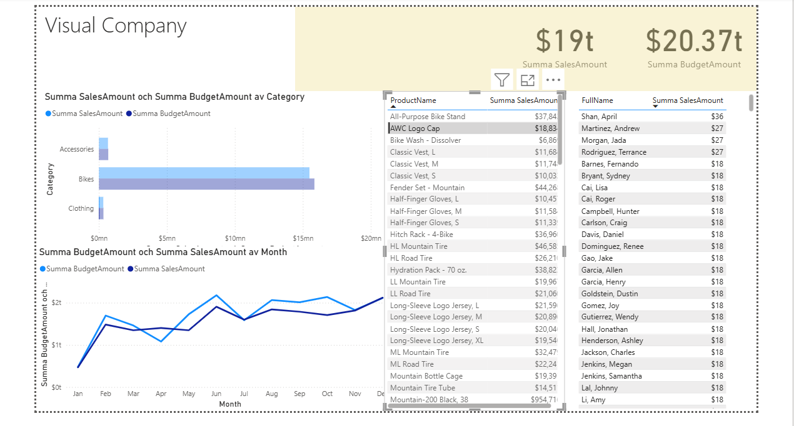

# Sales Dashboard

This is an interactive Sales Dashboard built in Power BI, designed to track KPIs such as total revenue, regional performance, product categories, and monthly trends.

## 📊 Features
- Dynamic slicers for Year and Region
- Bar and Line charts for sales trends
- Top-performing products table
- Clean, responsive design
# 📊 Power BI Portfolio

Welcome to my Power BI portfolio! This repository contains data visualization projects created using Microsoft Power BI. Each project demonstrates skills in data modeling, DAX, interactive design, and business-focused analytics.

---

## 🚀 Projects

### ✅ [Sales Dashboard](./SalesDashboard)
An interactive report built to track KPIs such as:
- Total revenue
- Regional performance
- Product categories
- Monthly sales trends

> 📁 Includes: `.pbix` file, dashboard screenshot, and project description.

---

## 📌 Tools & Skills Used
- Power BI Desktop
- DAX (Data Analysis Expressions)
- Data transformation with Power Query
- Data modeling and relationships
- UX/UI design for dashboards

---

More dashboards coming soon:
- HR Analytics
- Marketing Performance
- Customer Segmentation

Stay tuned!

## 📁 Files
- `report.pbix`: The Power BI file
- `dashboard.png`: Screenshot preview

## 🖼️ Preview

## 🔍 Tools Used
- Power BI Desktop
- DAX
- Data modeling
